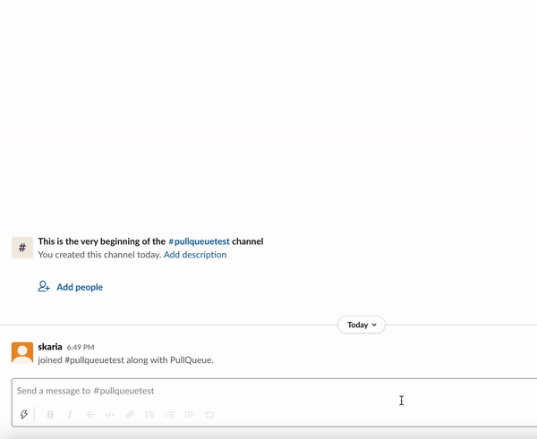

# PullQueue

PullQueue is a lightweight slack bot/app that listens for all messages in a channel and adds any github pull requests to a queue.

*Note: This app does NOT store or persist any data, nor does it connect to github for additional information; instead, it uses slack pinned messages to maintain its state.*

## How it works
1. Any message in the channel will be parsed for github urls, which will trigger the bot.
2. If there is no queue, the bot will send a message creating it and pinning it to the channel. If there's already a pinned message, it will be edited.
3. For each github url in the message, an item will be added to the queue containing:
    - Author who requested it
    - Github link
    - Link to original message sent in the channel
    - Complete button to remove it from the queue
4. The bot will send a message reply to the original message, confirming that it has added the person's request(s) to the queue.
5. You can also call `/prs` for the bot to re-send the queue to the channel and pin it again.

---

## Setup

Clone the repo. Follow instructions to [create a slack app for your workspace](https://api.slack.com/start/building/bolt-python) and run the app, using this repo as the code for your app.

Bot Token scopes required for the app to function correctly:
- `app_mentions:read`
- `channels:history`
- `chat:write`
- `commands`
- `groups.history`
- `pins.read`
- `pins.write`
- `users.profile:read`

Make sure your event and interactivity urls route to your `your.server.com/slack/events`.